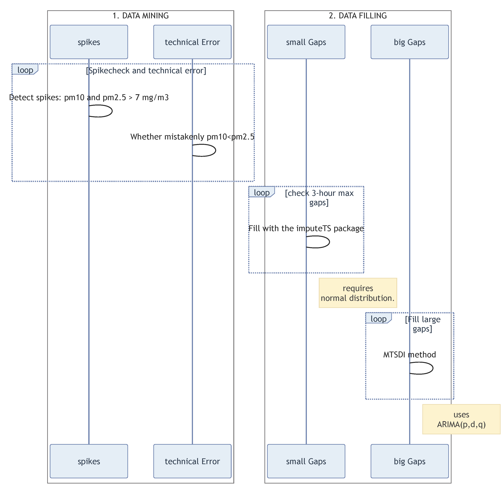
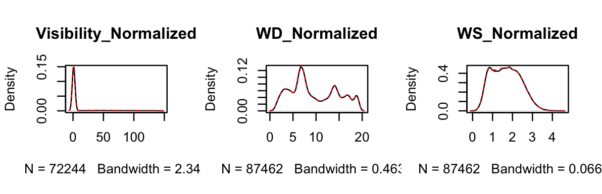
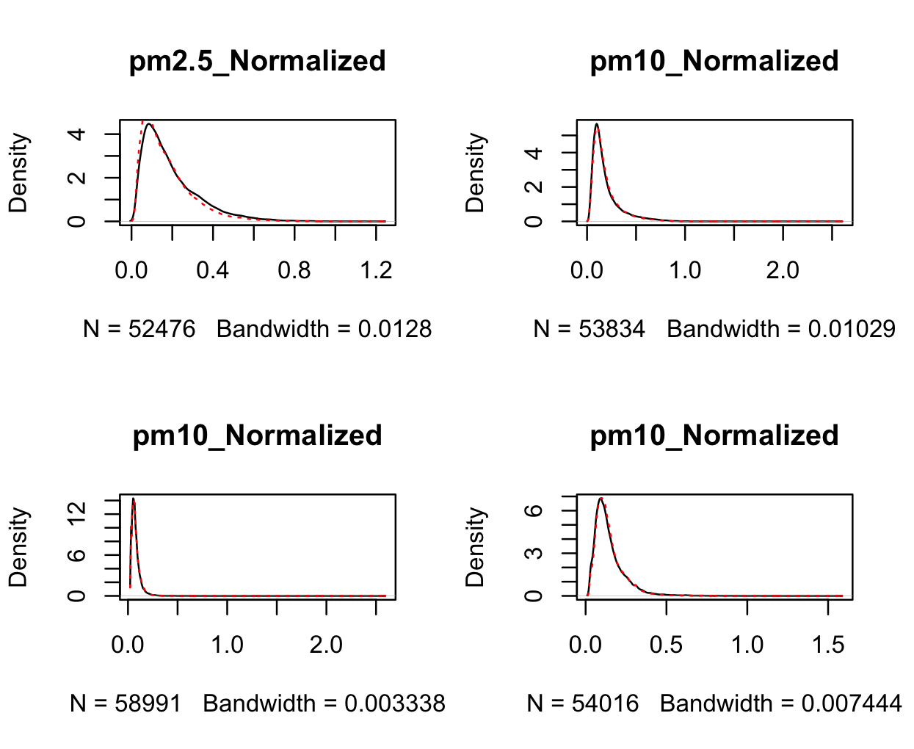

```{r knitr_settings, eval=TRUE, echo=FALSE, cache=FALSE}
knitr:: opts_chunk$set("tidy" = FALSE)
knitr:: opts_chunk$set("echo" = FALSE)
knitr:: opts_chunk$set("eval" = TRUE)
knitr:: opts_chunk$set("warning" = FALSE)
knitr:: opts_chunk$set("cache" = FALSE)

inline_hook <- function(x){
	print(x)

	if(is.list(x)){
		x <- unlist(x)
	}

	if(is.numeric(x)){
		if(abs(x - round(x)) < .Machine$double.eps^0.5){
			paste(format(x,big.mark=',', digits=0, scientific=FALSE))
		} else {
			paste(format(x,big.mark=',', digits=1, nsmall=1, scientific=FALSE))
		}
	} else {
    	paste(x)      
	}
}
knitr::knit_hooks$set(inline=inline_hook)
```

```{r}
library(tidyverse)
library(knitr)
# library(here)
```

\vspace{35mm}

Running title: INSERT RUNNING TITLE HERE

\vspace{35mm}

Munkhtsetseg. E, Shimizu. A, Matsuki. A, Batdorj. D, Matsui. H,
Bayanjargal. D

\vspace{40mm}

To whom correspondence should be addressed:

\newpage
\linenumbers

Plain text summary Driven by industrial progress in the mining sector,
household coal combustion has increased significantly in Mongolia since
the 2000s. Demographic evidence has revealed an ongoing reduction in
rural-nomadic lifestyle and a rise in urban population, which may
gradually extend household winter heating as a major source of fine
particulate matter (PM2.5). In conjunction with a stagnant atmosphere
and observations that winter fine pollutants (PM2.5 and PM10) are
persistently trapped within the boundary layer and can be exacerbated by
stagnant weather or emission sources, these results have led to
hypotheses that fine aerosols may be subject to suspension in the
near-surface atmosphere, potentially available for emission via dust
storms in the spring. Here, through the analysis of long-term datasets,
we demonstrate distinct spatio-temporal patterns in variations of PM10
and PM2.5 relative to recent drivers of emission sources in Mongolia,
and that the concentration of PM2.5 in a Gobi town has increased in
association with winter heating. Furthermore, the ratio of fine to
coarse aerosols indicates that the fine fraction in the spring has
increased despite decreased wind speeds. Our results strongly suggest
that the aerosol fraction has undergone changes at the local-level, and
is subject to both natural and anthropogenic constraints.

## Abstract (150 words: 200, cut 50 words )

Here, through the analysis of long-term datasets, we demonstrate
distinct spatio-temporal patterns in variations of PM10 and PM2.5
relative to recent drivers of emission sources in Mongolia, and that the
concentration of PM2.5 in a Gobi town has increased in association with
winter heating. Furthermore, the ratio of fine to coarse aerosols
indicates that the fine fraction in the spring has increased despite
decreased wind speeds. Our results strongly suggest that the aerosol
fraction has undergone changes at the local-level, and is subject to
both natural and anthropogenic constraints.

\newpage

## Introduction /Why you should care/

Gobi Desert is known for its high dust storm frequency and substantial
dust emissions, precise quantification of its contribution to the global
dust budget is somewhat simplified. It is well defined that Mongolian
dust has a brown color, seasonal characteristics, mainly consisted
coarse fractions. Mongolian dust has an attention of the its mass
fraction in global dust, yet unlikely elaborated in the climate models
due to its majority of coarse fraction for its a small contribution to
the climate system through its radiative feedback.　But, such recognized
characterization might get no longer valid due to recent change in the
driving of the emissions of air particulate matters. POINT 1: AEROSOL
EFFECTS ON radiation POINT 2: COLD DESERTS, POINT 3: AIR QUALITY AND
HEALTH

Aerosols from cold arid areas, particularly the Gobi Desert in Asia,
constitute the second most substantial global source of atmospheric
aerosols (Fitzgerald et al., 2015). These dust particles considerably
impact Earth's radiative equilibrium by directly scattering solar
radiation and serving as nuclei for cloud droplet and ice crystal
formation, while also influencing climate through its interactions with
solar radiation (Huang et al. 2014), clouds (Kawai et al. 2021), and
terrestrial and oceanic biogeochemistry (Jickells et al. 2005; Mahowald
et al. 2017). This dust is carried towards the North Pacific by
prevailing westerly winds (Husar et al. 2001; Uno et al. 2009),
significantly affects local and regional air quality (Sugimoto et al.
2003; Jugder et al. 2011) and human health (Higashi et al. 2014).

There has been a [tremendous improvement] in the understanding of
atmospheric aerosols and their climate effect over the last decades,
with some important observational and modelling breakthroughs. Long-term
measurements of aerosols (e.g., Nishikawa et al. 2010, Andrews et al.
2011), observational campaigns (e.g., Shinoda, Park, chinse), and lidar
(Holben et al. 1998, Remer et al. 2008), and bioaerosol (dd), health
(ff) have remarkably increased knowledge about the composition and
characteristics of atmospheric aerosols. dust brown color, seasonal
characteristics, with coarse fractions. Gobi Desert dust typically has a
shorter atmospheric residence time (1.5 days) tends to remain at lower
altitudes, (Tanaka, 2012) During dust storms, PM2.5 and PM10
concentrations can surge to 343 and 1.642 $\mu g m^{-3}$, respectively
(Filonchyk et al., 2021). Regarding aerosol fractions, PM2.5 and PM10
concentrations in the Gobi Desert area were found to be 36.2 ± 23.7 and
97.3 ± 84.5 $\mu g m^{-3}$, respectively (Filonchyk et al., 2021). Clean
continental aerosol type is predominant (73.9 percent), followed by
mixed aerosols (20.4 percent), with minor contributions from clean
marine, urban/industrial, biomass burning, and desert dust aerosol
types. During dust storms, PM2.5 and PM10 concentrations can surge to
343 and 1.642 $\mu g m^{-3}$, respectively (Filonchyk et al., 2021) Gobi
Desert is known for its high dust storm frequency and substantial dust
emissions, precise quantification of its contribution to the global dust
budget is challenging. Nevertheless, the land surface parameters
governing Asian dust emissions exhibit substantial seasonal and
inter-annual variations and complex interactions, leading to significant
uncertainties in simulating them for Asian dust (Kawai Sola 2021).

Advanced the knowledge of global dust, has reached to recognize the
sources,. Classification dust brown color, seasonal characteristics,
with coarse fractions. Much studies, The Gobi Desert is a primary source
of global atmospheric aerosols, with dust emissions heavily influenced
by wind strength and surface dust availability (Liang et al., 2021).
Gobi Desert dust typically has a shorter atmospheric lifetime (1.5 days)
compared to Taklimakan Desert dust (2.1 days) (Tanaka, 2012), indicating
differences in transport patterns and atmospheric persistence (Tanaka,
2012). Gobi dust tends to remain at lower altitudes, while Taklimakan
dust can be transported to higher elevations, potentially contributing
to the Asian tropopause aerosol layer (Tanaka, 2012). Gobi Desert is
known for its high dust storm frequency and substantial dust emissions,
precise quantification of its contribution to the global dust budget is
somewhat simplified. It is well defined that Mongolian dust has a brown
color, seasonal characteristics, mainly consisted coarse fractions.

\newpage

This knowledge further efficient to climate system when elaborating
dust-aerosol effects. But, a large uncertainties in the global dust
model has existed so for climate models which clearly limits our
understanding the climate system and shape the facing global issues of
global warming. This is first mainly, caused by the lack of
parameterization and the complex nature of its aerosol composition.
[AND] surface ... [AND] anthropogenic, livestock These findings highlight
the significant contribution of the Gobi Desert to global dust aerosols
and the complex nature of its aerosol composition.

Second, the significant contribution of the Gobi Desert to global dust
aerosols is not fully recognized; and their is the rapid growing changes
controlled by the natural forces and anthropogenic drivings. Mongolian
dust has an attention of the its mass fraction in global dust, yet
unlikely elaborated in the climate models due to its majority of coarse
fraction for its a small contribution to the climate system through its
radiative feedback. ...Rapid change ; few research; needs to enroll such
changes and multidisciplinary

But, such recognized characterization might get no longer valid due to
recent change in the driving of the emissions of air particulate
matters. A large high concentrations of PM2.5 in the capital city of
Mongolia has been observed as a result of the heavy consumptions of coal
as a winter heating has rapidly spread as a mining industry taken off
since 2000. Demographic evidence has revealed an ongoing reduction in
rural-nomadic lifestyle and a rise in urban population, which may
gradually extend household winter heating as a major source of fine
particulate matter (PM2.5). Winter weather stagnant conditions governed
by the Siberian magnifies the concentrations of the particulate matter
emissions by trapping the polluted air below the boundary layer, so that
results in a very large high concentrations of PM2.5, locally. Even
within a short span, UB has recognized as one of the highly polluted
capital cities in the world.; resulted a human health issues.

Therefore, It is important to examine the emerging changes and shifting
patterns of air particulate matters in Mongolia. More importantly, it is
essential to reveal the significant changes in the the altered fraction
particularly, in the dust seasons considering its high potential of
intriguing in the free atmosphere to transported in the long-distance,
so carrying capacity of the role to shift the global climate system, and
its side impacts on downwind regions.

-   Study goal - We hypothesize ... - Our study will benefit not only to
    the global dust research but also climate, and further to the
    country itself for urban planning, and coal combustion.

### Research Qs

Therefore, we aimed to demonstrate the distinct temporal and spatial
variations of PM2.5 and PM10 across urban and rural Mongolia using
extensive data from 2008 to 2020.

On spring, the dust storm from the Gobi Desert contribute significantly
to increased aerosols in the atmosphere and ambient air pollution,
leading to sporadic peaks in PM10 concentrations reaching as high as
64-234 $\mu g m^{-3}$ per day or exceeding 6000 $\mu g m^{-3}$ per hour
(Jugder). concentrations of particulate matter is ephederemal, yet vary
depending on whether the pollution cause is natural or industrial, local
or transported, seasonal or non-seasonal, makes complex and challenging.

1.  Do concentrations of particulate matters differ in between urban and
    rural sites, and even within Gobi sites? 2. Do distinct temporal
    variations has existed among the sites? 3. Do PM2.5 particulates has
    contributed to the PM10 annual variations?

-   If yes, how much, and when and where?
-   What is the sd, mean, and median
    -   box plot
    -   violin
    -   scatter points, epidemic, sporadic
-   Daily variations to examine it related to the heating
    -   2 peaks: smaller and bigger
    -   compare the t-duration exceeds 50 mug/m3/hour

4.  Does it has distinct patterns among the sites regarding to the
    drivings

-   How PMs varies with the wind speed and visibility
-   Do they differently explained with variables and changes in drivings
    (with PCA analysis)

5.  Is there any significant changes in time-series of PMs at 4 seasons
6.  Is there any significant changes in ratio in the spring in respect
    to winter pollutions?

## Results

### The spatio-temporal variations of the PMs at the study sites

To evaluate the spatial variations in particulate matter (PM)
concentrations, we displayed hourly observed values of PM10 and PM2.5
for all study sites (figure_3). The mean p-values indicate that PM
concentrations differ significantly at a 99% confidence level across all
sites (figure_3), with the exception of a 95% confidence level between
DZ and UB for PM10 (figure_3a), highlighting substantial concentration
disparities among sites. While quantitative differences in PM
concentration values exist across all sites, two key patterns emerge
when examining median deviations from mean values and irregular
observation fluctuations. For instance, PM10 demonstrates more erratic
behavior than PM2.5 at each location, particularly evident at ZU and SS
sites. Furthermore, the mean values calculated from hourly measurements
surpass the median concentrations for both PM10 and PM2.5 across all
sites, with notable prominence at UB and DZ locations. Consequently,
significant spatial differences in PM concentrations exist among all
sites, regardless of urban or rural classification. However, the sites
can be categorized into two groups based on their characteristics: UB
(urban) and DZ (rural town, Gobi); and SS (rural, Gobi) and ZU (rural,
Gobi). These findings for DZ appear to support our hypothesis of
emerging new emission patterns related to increased coal consumption
during winter months.

To investigate whether emerging PM patterns are associated with
household winter heating activities, we demonstrated annual variations
in PM10 and PM2.5 concentrations at the sites. Significant annual
variations in PM10 and PM2.5 levels were observed at UB and DZ sites,
with maximum concentrations exceeding 100 $\mu g/m^3$ during colder
months (January, November, December) and lower levels consistently below
50 $\mu g/m^3$ during warmer months (May-September). These annual
maximums coincided with the diurnal variations in PM10 and PM2.5
concentrations at sites DZ and UB, where PM concentrations reached their
highest values during nighttime and early morning hours (approximately 8
PM to 4 AM UTC), with median values surpassing 50 $\mu g/m^3$.
Conversely, both pollutants exhibited reduced concentrations during
daytime hours (8AM to 4PM UTC), likely due to increased atmospheric
dispersion. UB site exhibited similar daily fluctuations with extended
periods (approximately 8 PM to 5 AM UTC) of elevated concentrations.
Additionally, winter PM10 concentrations at both sites were primarily
composed of PM2.5 (figure_5; mean values for PM10 with the color bar).
The increase in PM10 and PM2.5 aligns with the heating active hours,
suggesting that household coal consumption contributes to elevated PM
levels at both DZ and UB sites. In contrast, ZU and SS sites displayed
significantly lower annual PM10 and PM2.5 levels, with sudden frequent
spikes in spring followed by occasional instances in autumn. These
annual variations were more pronounced in PM10 compared to PM2.5,
highlighting the impact of Gobi dust and sand storms. Similar
occurrences were also noted at the DZ site, suggesting its exposure to
both winter heating emissions and natural spring dust, reflecting its
Gobi-region characteristics. The annual variability in PMs with higher
concentrations during nighttime and colder months, indicating the
influence of localized emission sources and reduced boundary layer
mixing at UB and DZ sites. Additionally, the upward extended ranges
without the bottom bottle of the violin plot, demonstrating greater
variability during colder months. It implies instability in
concentrations potentially reaching high levels above 400 $\mu g/m^3$
when Arctic oscillation/Siberian high intensifies with heating, and
dropping below 50 $\mu g/m^3$ when it weakens or heating demand
decreases. These findings confirm the (DZ) emerging PM pattern is caused
by household activities and influenced by meteorological conditions.
Overall, meteorological factors appear to play a crucial role in
governing PM levels.

### The emission patterns of interrelations among meteorological variables at the study sites

add table, add r 1.3, 2 on figure_6, add supplement figures

To identify the key factors influencing PM emissions, we examined the
relationships between wind speed (WS), visibility (VIS), and particulate
matter (PM10 and PM2.5) concentrations across the study sites
(figure_6). In UB during winter, elevated PM levels typically coincide
with low wind speeds and reduced visibility (indicated by darker blue
points). Notably, at DZ and ZU locations, high PM10 concentrations were
observed during both low and high wind speed conditions in winter. All
Gobi sites exhibit the greatest variation in PM concentrations during
spring, with extreme outliers primarily associated with increased WS and
reduced visibility below 10000 km. Similar findings were also revealed
through Principal Component Analysis (PCA). The initial two principal
components (Dim 1 and Dim 2) account for 66.52% of the total variance.
Dim 1 shows a strong association with PM10 and PM2.5, while visibility
demonstrates an inverse correlation, suggesting that reduced visibility
corresponds to higher pollution levels. Wind speed and direction align
positively with Dim 2 (22.16%), reflecting their impact on emissions.
When comparing PM10 aligns with PM2.5, the 1:1 ratio increases
approximately 1.3 times for UB, 2 times for DZ, XXX for ZU, and XXX for
SS as PM10 concentrations increase. This increase in Gobi sites further
escalated up to 2-5 times in ZU, and XXX times in SS sites, indicating
insufficient PM2.5 particulates in those locations, particularly at the
ZU site. It is worth noting that instances where PM2.5 values exceed
PM10 reflect equipment accuracy, correction errors, and higher
sensitivity rates (ability to record emissions such as smoking near the
sensor area). However, this discrepancy diminishes as PM concentrations
increase, validating that higher observational records of PM2.5 compared
to PM10 do not invalidate our results. Furthermore, clustering of
monitoring sites based on PM concentrations and geographic features
(Figure 7b) reveals distinct patterns. UB (urban, capital city) is
characterized by high PM concentrations (positive Dim 1 scores), while
SS (rural, Gobi, town (site located in the prevailing wind above the
town)) shows low PM levels, clustering tightly along the negative Dim 1
axis. DZ (rural, Gobi, town center) displays considerable variability,
with clusters extending into higher Dim 1 and Dim 2 ranges, reflecting
the complex interplay of emission sources and meteorological factors. ZU
(rural, Gobi, village) overlaps with SS but exhibits greater spread,
indicating moderate pollution levels influenced by seasonal and
localized factors. These findings highlight the complex interplay of
spatial, meteorological, and local factors influencing air particulate
matter concentrations across the studied locations and emphasizing the
need for considering not only regional influences but also site-specific
characteristics.

fig caption: the Principal Component Analysis (PCA) bi-plot (Figure 7a)
highlights the relationships among key variables, including PM10, PM2.5,
wind speed (WS), wind direction (WD), visibility, ratio of PM2.5 to PM10
(r), and numbers of aerosols by optical particle counter (OPC). The
first two principal components (Dim 1 and Dim 2) explain 66.52% of the
total variance, with Dim 1 (44.36%) strongly associated with PM10 and
PM2.5. Wind speed and wind direction are positively aligned with Dim 2
(22.16%), reflecting their influence on pollutant dispersion.

### The recent trends in concentrations of PMS and fine-coarse fractional changes at the sites

add table, add trend figure: r, add relationship figure: r in spring and
pm2.5 in winter

Figure 8 illustrates the trend analysis of PM10 and PM2.5 concentrations
across study sites from 2009 to 2020. The time series demonstrates
seasonal patterns and trends, with p-values of trend changes,
seasonally: winter (Q1), spring (Q2), and summer-autumn (Q3). At UB,
significant negative trends both in PM10 and PM2.5 concentrations are
observed for winter and spring (Q1 and Q2, p \< 0.001). At DZ, a
significant positive trend in PM10 and PM2.5 concentrations is observed
for winter (Q1, p \< 0.001), indicating increasing particulate matter
levels during this season. At ZU, a significant negative trend is
observed in both PM10 and PM2.5 for winter (Q1, p \< 0.001), suggesting
a consistent reduction in particulate matter during winter months (may
reduced transboundary traffic associated with covid periods, resulted in
declined PM10 concentrations; or data gaps). At SS, a negative trend is
observed in PM2.5 for spring (Q2, p \< 0.001), reflecting a seasonal
decline potentially linked to reduced wind speed during spring. The
significant decreasing trends in PM concentrations in UB during colder
months likely indicate improvements in emission control measures and a
transition to more efficient heating practices. In contrast, a
significant increasing trend is observed at DZ, particularly during
winter (Q1), suggesting rising emissions potentially associated with
urbanized household practices and other local activities in Mongolia's
regional towns.

ratio in spring when dust 

Dust particles are emitted from the surface to the atmosphere when wind
speed on the surface (i.e., friction velocity) u\* exceeds a threshold
value u*t, which is determined from soil particle size and land surface
conditions (Shao 2008). In the case of Asian dust, u*t is controlled by
a number of land surface parameters such as snow cover, soil moisture,
soil crust, soil freezing, and vegetation (Kurosaki et al. 2011),
reflecting the location of its source regions (mainly the Gobi and
Taklimakan Deserts) at middle latitudes and high altitudes.

## Conclusions

Arctic oscillation, the atmospheric system most influenced by global
warming, triggers Arctic-Asian Dust with its potential phase changes ().
Understanding how Arctic oscillation may interact with variability of
concentrations in particulate matter (PM) in colder regions will
contribute to the comprehension of these climate-teleconnection systems
and their anthropogenic feedback mechanisms. Assessments of how aerosol
fractions in the Gobi dust source region are affected by anthropogenic
factors will provide better predictions of dust-aerosols and facilitate
the reduction of household emissions under future climate scenarios.
This information becomes increasingly significant if the negative phase
of arctic oscillation intensifies and subsequent cold intensity and
frequency increase with global climate change, as some models predict
(....). In addition to changes in aerosol fraction, a warming climate
will be driven by it as a key factor influencing the Earth's radiative
energy balance.

In general, aerosols increase the outgoing solar radiation at the top of
the atmosphere (TOA) through reflection, thus producing a planetary
cooling effect. However, aerosols can also produce a warming effect due
to increased reflected radiation from the surface, which enhances the
aerosols' absorption. Recent shifts in surface types and their
corresponding fine particulates, driven by both human activities and
natural processes, raise a pivotal and yet unresolved question: How do
these alterations impact the radiation budget of the Earth?

This research provides crucial insights into the complex interplay
between Arctic oscillation, aerosol fractions, and climate change in
Mongolia's Gobi Desert region. By analyzing long-term datasets of PM10
and PM2.5 concentrations, we have uncovered distinct spatio-temporal
patterns and trends in aerosol fractions, revealing the significant
impact of both natural processes and human activities on air quality and
climate dynamics.

Our findings demonstrate that the fine-to-coarse aerosol ratio has
increased in the Gobi region, particularly during spring, suggesting a
shift in aerosol composition towards finer particles. This change is
likely driven by anthropogenic activities, especially winter heating,
which contributes to the accumulation of fine pollutants in the
atmosphere. The persistence of these pollutants through spring, combined
with natural dust emissions, indicates a fundamental alteration in the
aerosol profile of Mongolian Gobi dust.

These changes in aerosol composition have significant implications for
regional and global climate systems. While aerosols have traditionally
been associated with planetary cooling through increased reflection of
solar radiation, our research highlights the growing importance of fine
aerosol fractions in contributing to warming effects. This shift
challenges existing assumptions about aerosol-climate interactions and
underscores the need for more nuanced climate models that account for
these complex dynamics.

The study also emphasizes the critical role of human activities in
shaping regional air quality and climate patterns. The observed increase
in PM2.5 concentrations in Gobi towns, particularly associated with
winter heating, illustrates the tangible impact of anthropogenic
emissions on local environments. This finding underscores the importance
of targeted interventions to reduce household emissions, especially
during winter months, as a means of mitigating both local air quality
issues and broader climate impacts.

Our research opens up several avenues for future investigation,
including the study of winter pollutant behavior during spring thawing,
the transformation of black carbon during deposition and transportation,
and the broader environmental implications of changing aerosol
fractions. Additionally, the potential consequences of continued coal
use and population growth on PM2.5 levels and global climate systems
warrant further examination.

In conclusion, this study contributes significantly to our understanding
of the complex relationships between aerosols, atmospheric systems, and
climate dynamics in the Gobi Desert region. By bridging critical
knowledge gaps and providing evidence of changing aerosol compositions
and their impacts, our findings offer valuable insights for refining
climate models, informing policy decisions, and developing strategies to
mitigate the effects of climate change. As we continue to grapple with
the challenges of a changing climate, research such as this will be
instrumental in guiding our efforts to create a more sustainable and
resilient future.

The present study will contribute significantly to the understanding of
air particulate matter patterns in Mongolia and providing comprehensive
data insights for policymakers and public health sectors. Our findings
is useful not only for addressing national health impacts but also
beneficial for understanding air particulate matter as ambient air
pollution, and tackling atmospheric aerosol effects in the climate
system, and revealing their transboundary effects to the downwind
regions in South-east Asia.

2.  Summarize the main findings Novel conclusions: that change/advance
    our understanding of the field
3.  Interpret the results within a broader context

In this study, Spatio-temporal distinct patterns in variations of
$PM_{10}$ and $PM_{2.5}$ relative to the recent drivings of emission
sources in Mongolia we investigated the temporal variations of PM2.5 and
PM10 concentrations at the 4 sites of rural and urban those located
along the the wind corridor.

Air particulate matter concentrations in urban-town sites of UB and DZ
is episodically dictated by dust events in spring or late autumn, yet
seasonally governed by anthropogenic emissions in winter. Air
particulate matter concentrations in rural sites of SS and ZU is
episodically dictated by dust events in spring or late autumn. Air
quality in urban sites is episodically dictated by dust events in spring
or late autumn, yet seasonally governed by anthropogenic emissions in
winter. [Air quality is governed by natural dust emission, and
anthropogenic emissions]

Three distinct variations has been detected. 1. A new pattern is emerged
It is evident of the new emission patterns in Mongolia. With recent
growing interest in urban life style, and combustion of coal/oyutolgoi
for heating winter conditions results a highly increase in not only
capital city but also towns

In a result, spring coarse dust, plus winter fine pollutants Related to
the winter emission patterns, fine particulates fraction in the spring
is increased. r ratio shows ... emission source; dust might carry
anthropogenic fine particulates as well. [spring coarse dust is
immediately transported and deposited in the source area, whereas winter
fine pollutants is permanently stayed in the source area due to stagnant
atmosphere govern over entire country., perhaps floating in the near
surface, deposits in the surface] We found spring fine to coarse
fraction has increased in a Gobi town, suggesting winter fine pollutants
is permanently stayed in the source area due to stagnant atmosphere
might related to AO, is emitted in the spring with the dust. This
indicates the Mongolian Gobi dust aerosol fractions has changed with a
more fine pollutants, so has an aerosol radiation effects.

-   Alarms, the Mongolian dust in the spring, optical properties will be
    shifted; this gives ... Gobi dust and sand storms has become tuiren,
    from the shoroon shuurga. which clearly requires the attention. Main
    conclusion 1: A distinct pattern is emerged as a ... Main conclusion
    2: Trends in atmospheric fine particulate concentrations since 2008
    were driven and modified by anthropogenic emissions in DZ Main
    conclusion 3: Trends in fine to coarse fraction is increased in the
    spring in DZ Main conclusion 4: WS is decreased; with the wind speed
    up to... Main conclusion 5: Such changes is local. Main conclusion
    6: Our study highlighted the attribute of Gobi dust as a cold
    desert, with the anthropogenic impact.

4.  Point limitations/alternate interpretations

5.  Describe implications for other systems

6.  List practical applications National level; meteorological impact is
    large. ... However, reduced... On the other hand, it is ... with the
    towns. This points that air quality will be poor whether it is
    changed fuel, .. unless to change heating system. Therefore, it is
    not the reason to move the capital city. Only solution is to change
    the heating system, do not burn any type of the coal.

7.  Suggest areas for future research

-   Winter pollutants state in the land surface go under chemical
    reaction as soil thawing process in the spring or invoke the
    airborne infection?
-   black carbon, has a death records. In winter, it has detrimental
    effects on local; in spring, it will bring the effect on the
    downwind regions. More dangerously, how much it changed its initial
    form during the depositions and transportation period. More,
    research has focused on the direct emission of black carbon to the
    atmosphere. However, it is not clear the changed form of black
    carbon on its properties, and chemical compositions so on.
-   Other environmental problems?
-   If continued use of coal, with the population increase result the
    more and more pm2.5, and affect Climate system.

The findings not only contribute to our understanding of the climate
impacts of aerosol and surface albedo, but also emphasize the importance
of integrating these factors into climate models and strategies aimed at
mitigating climate change.

\newpage

## Study materials and Methods

### A description of study sites

Mongolia's diverse geography and climatic conditions provide a unique
backdrop for understanding particulate matter pollution and its impacts.
This study focuses on four distinct locations across the country,
selected to represent varying urban and desert environments with
different elevations and climatic conditions.

Ulaanbaatar (47.92°N, 106.92°E): The capital city, situated at an
elevation of 1350 m, characterized by high urban activity and associated
air pollution.

Dalanzadgad (43.57°N, 104.42°E): A Gobi Desert town at an elevation of
1470 m, representing arid and sparsely populated areas.

Sainshand (44.87°N, 110.12°E): Located at an elevation of 947 m,
featuring semi-arid conditions.

Zamyn Uud (43.72°N, 111.90°E): A border town at 967 m elevation,
characterized by cross-border trade activities.

Table 1 summarizes the geographical coordinates, elevations, and
relevant site characteristics, while Figure 1 provides a spatial
representation of the locations. These sites capture a wide spectrum of
environmental conditions, facilitating a comprehensive assessment of
particulate matter pollution.

### Data

Data Collection

Particulate matter with aerodynamic diameters less than 2.5 (PM2.5) and
10 micrometers (PM10) were measured at these sites using an instrument
that measures light scattering by air-borne particulates. Meteorological
parameters, including wind speed, wind direction and visibility were
determined by automatic instruments and are detailed in previous
articles (Jugder et al., 2011, 2012; Nishikawa, Sugimoto). The
instruments for measuring particulate matters were placed 2 m above
the ground level (AGL) at Dalanzadgad, Sainshand and Zamyn-Uud (Table
2.1). Wind sensors and visibility (meteorological optical range-MOR)
sensors with a maximum measurement range of 20 km were installed at a
height of 3 m AGL at the three Gobi sites. At the Ulaanbaatar site, the
wind sensor height and a visibility sensor was placed at 15 m AGL.
Datasets were obtained from measurements at Dalanzadgad, Sainshand, and
Zamyn-Uud from January 2009 to May 2018, and at Ulaanbaatar from the end
of April 2008 to May 2020.

To improve the data quality, we removed spikes exceeding above 7 $\mu g m^{-3}$ considering the reported extreme values (XXXXX Jugder, XXXX Tsatsral), unrealistic PM2.5 values exceed PM10 (pm2.5 > pm10 *1.1) and detected signals that invariate with an extended period caused by electricity shortage and equipment
malfunctions for all sites. Further, we handled data each
stations separately to remove suspective data, carefully. For example, In Sainshand
station, … was … 
Prior to data quality improvement, there were missing data with percentages ranged from 10.3% to 23.6%, attributed to
equipment malfunctions or adverse weather conditions. Ulaanbaatar
demonstrated the highest data completeness for both PM2.5 (88.6%) and
PM10 (89.7%), whereas Dalanzadgad recorded the lowest (PM2.5: 76.4%;
PM10: 81.5%)(Table 1). After data quality improvement, missing data percentages 
has increased by XXXXXX.  [Due to electricity shortage and equipment
malfunctions contributed to the bad data, and missing data....]

The data used in the study are based on hourly means derived from 1 and 10 min averages. 
For trend analysis, we added the data derived after data filling with the procedure, detailed in the next section.

Data filling
Missing data handling with the statistical packages At last, we filled
the missing data with 3-hour maxgaps with imputeTS package for
univariate time series, and larger gaps using mtsdi R package (well-used
for time-series data), and improved the missing data percents by… from …
to … Additionally, meteorological parameters such as wind speed,
direction, and visibility are integrated into the analysis to elucidate
their impact on PM levels.

The MTSDI method (Junger, Santos, and Ponce de Leon (2003), Junger and
Leon (2012)) uses the EM algorithm with the Autoregressive Integrated
Moving Average (ARIMA) method, also known as Box–Jenkins model (Box et
al. (2015), Meyler, Kenny, and Quinn (1998)). The data provided by ARIMA
(p, d, q) depend on the number of autoregressive terms (p), the number
of differences (d), and the number of terms in the moving average (q)
(Meyler, Kenny, and Quinn (1998)). Default configuration was used. The
mtdsi method is widely used to impute missing data like in cosmic data
Fernandes, Lucio, and Fernandez (2017). Similar multiple imputation
methods have been applied for multivariate solar data Zhang et al.
(2020), highly univariate seasonal data even with the large amount of
missing data Chaudhry et al. (2019), missin data imputation and modeling
for leaching processes He et al. (2017). Recently, Motesaddi Zarandi et
al. (2022b) used the mtdsi method to imputing missing data air pollution
in Tehran (We used the complete data of temperature (°C), relative
humidity (RH) (%), wind speed (m/s), barometric pressure (BP) (mbar),
PM10, PM2.5, NO2, CO, and CVD variables to impute SO2 and O3 with the
mtdsi R package.).

Spatial Representation Figure 1 illustrates the geographical
distribution of study sites and the locations of meteorological
stations. The visual contrast between urban (e.g., Ulaanbaatar) and
desert (e.g., Dalanzadgad) environments underscores the spatial
variability in air quality measurements across Mongolia.


\newpage

{width="500"}

1.  Compare the concentrations of PMs at UB is the 2. Significance level
    difference 3. Conclude

\newpage

{width="530"}

1.  Clear annual variations at UB and DZ from pm2.5 pollutions 2. at ZU,
    and SS has a seasonally peaks episodic spring and late autumn from
    PM10

\newpage

{width="500"}

\newpage
\subsection{Meteorological influence on $PM_{10}$ and $PM_{2.5}$ variations}
\label{subsec2}

{width="500"}

\newpage

{width="300"}

{width="300"}

\newpage
\subsection{Trends}

{width="500"}

{width="600"}

\newpage

{width="300"}]

{width="400"}

\newpage

{width="300"}

\newpage

{width="300"}

{width="300"}

[@Munkh2017]

\newpage

## References
