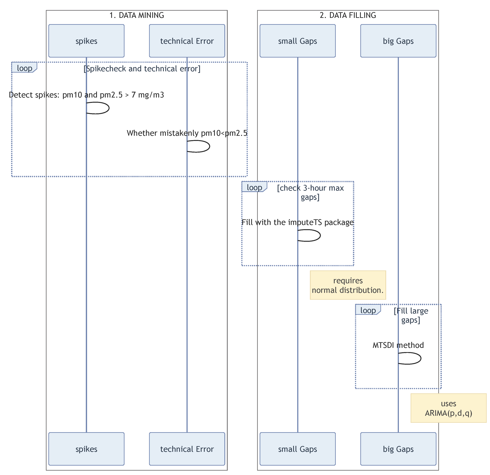
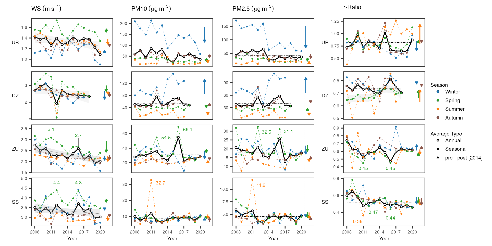

```{r setup, include=FALSE}
library(knitr)
knitr::opts_chunk$set(echo = FALSE)

library(pptxtemplates)

content_dimensions <- pptx_content_dimensions("reference_doc.pptx")

opts_template$set(
  full = content_dimensions$full,
  left = content_dimensions$left,
  right = content_dimensions$right
)
```


# Introduction

- Aerosols from cold arid areas, particularly the Gobi Desert in Asia,
constitute the second most substantial global source of atmospheric
aerosols (Fitzgerald et al., 2015).

- These dust particles considerably
impact Earth's radiative equilibrium by directly scattering solar
radiation ... (Advanced)

- a large uncertainties in the global dust
model has existed so for climate models which clearly limits our
understanding the climate system and shape the facing global issues of
global warming.
  - the lack of parameterization and the complex nature of its aerosol composition
  - the significant contribution of the Gobi Desert to global dust
aerosols is not fully recognized; and their is the rapid growing changes
controlled by the natural forces and anthropogenic drivings.
---

# Hypothesis
Driven by industrial progress in the mining sector,
household coal combustion has increased significantly in Mongolia since
the 2000s. Demographic evidence has revealed an ongoing reduction in
rural-nomadic lifestyle and a rise in urban population, which may
gradually extend household winter heating as a major source of fine
particulate matter (PM2.5). In conjunction with a stagnant atmosphere
and observations that winter fine pollutants (PM2.5 and PM10) are
persistently trapped within the boundary layer and can be exacerbated by
stagnant weather or emission sources, these results have led to
hypotheses that fine aerosols may be subject to suspension in the
near-surface atmosphere, potentially available for emission via dust
storms in the spring. 
---

# Study obejctives and questions
1.  Do concentrations of particulate matters differ in between urban and
    rural sites, and even within Gobi sites? 2. Do distinct temporal
    variations has existed among the sites? 3. Do PM2.5 particulates has
    contributed to the PM10 annual variations?

-   If yes, how much, and when and where?
-   What is the sd, mean, and median
    -   box plot
    -   violin
    -   scatter points, epidemic, sporadic
-   Daily variations to examine it related to the heating
    -   2 peaks: smaller and bigger
    -   compare the t-duration exceeds 50 mug/m3/hour

4.  Does it has distinct patterns among the sites regarding to the drivings
-   How PMs varies with the wind speed and visibility
-   Do they differently explained with variables and changes in drivings
    (with PCA analysis)

5.  Is there any significant changes in time-series of PMs at 4 seasons
6.  Is there any significant changes in ratio in the spring in respect
    to winter pollutions?

# 
In this study, Spatio-temporal distinct patterns in variations of
$PM_{10}$ and $PM_{2.5}$ relative to the recent drivings of emission
sources in Mongolia we investigated the temporal variations of PM2.5 and
PM10 concentrations at the 4 sites of rural and urban those located
along the the wind corridor.
# Study sites and data

## Study sites

-   UB (urban, in capital city, at center)
-   DZ (gobi, inside town, at center)
-   SS (gobi, outside town, at edge)
-   ZU (gobi, inside village, at center)

{width="300"}]

------------------------------------------------------------------------

## Data

{width="400"}

------------------------------------------------------------------------

## Data cleaning

{width="300"}

------------------------------------------------------------------------

## Data filling

::: columns
::: column
{width="300"}
:::

::: column
{width="300"}
:::
:::

------------------------------------------------------------------------

# Results

## Comparisons

{width="300"}

------------------------------------------------------------------------

## Temporal variations

::: columns
::: {.column width="50%"}
{width="330"}
:::

::: {.column width="50%"}

{width="300"}
:::
:::

------------------------------------------------------------------------

## Meteorological influence on PM10 and PM2.5 variations

{width="300"}

------------------------------------------------------------------------

## Spatio-temporal distinct feature

::: columns
::: {.column width="50%"}
{width="200"}
:::

::: {.column width="50%"}
{width="200"}
:::
:::

------------------------------------------------------------------------

## Trends

{width="300"}

------------------------------------------------------------------------
## Ratio pm2.5/pm10

{width="300"}

------------------------------------------------------------------------

# Conclusions
- Three distinct variations has been detected. 1. A new pattern is emerged
It is evident of the new emission patterns in Mongolia. With recent
growing interest in urban life style, and combustion of coal/oyutolgoi
for heating winter conditions results a highly increase in not only in
capital city but also in town.
- We found spring fine to coarse
fraction has increased in a Gobi town, suggesting winter fine pollutants
is permanently stayed in the source area due to stagnant atmosphere
might related to AO, is emitted in the spring with the dust. 
- This indicates the Mongolian Gobi dust aerosol fractions has changed with a
more fine pollutants, so does may have an altered aerosol radiation effects.

# Suggest areas for future research
-   Winter pollutants stayed in the land surface go under chemical
    reaction as soil thawing process in the spring or invoke the
    airborne infection?
-   black carbon, has a death records. In winter, it has detrimental
    effects on local; in spring, it will bring the effect on the
    downwind regions. More dangerously, how much it changed its initial
    form during the depositions and transportation period. More,
    research has focused on the direct emission of black carbon to the
    atmosphere. However, it is not clear the changed form of black
    carbon on its properties, and chemical compositions so on.
-   Other environmental problems assocolated with the condition might exist.
-   If the country use of coal continue on, with the population increase result the
    more and more pm2.5, and affect climate system.

#  Practical applications on national level
- meteorological impact is
    large. ... 
- On the other hand, it is ... with the towns where has sparsely populated. 
- This points that air quality will be poor whether it is
    changed fuel, .. unless to change heating system. 
- Therefore, it is
    not the reason to move the capital city. Only solution is to change
    the heating system, do not burn any type of the coal.